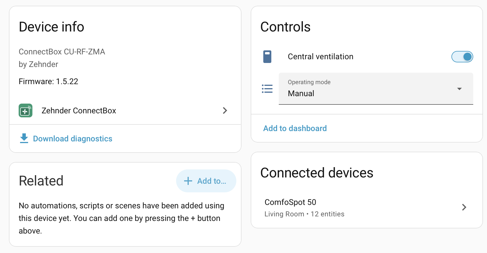
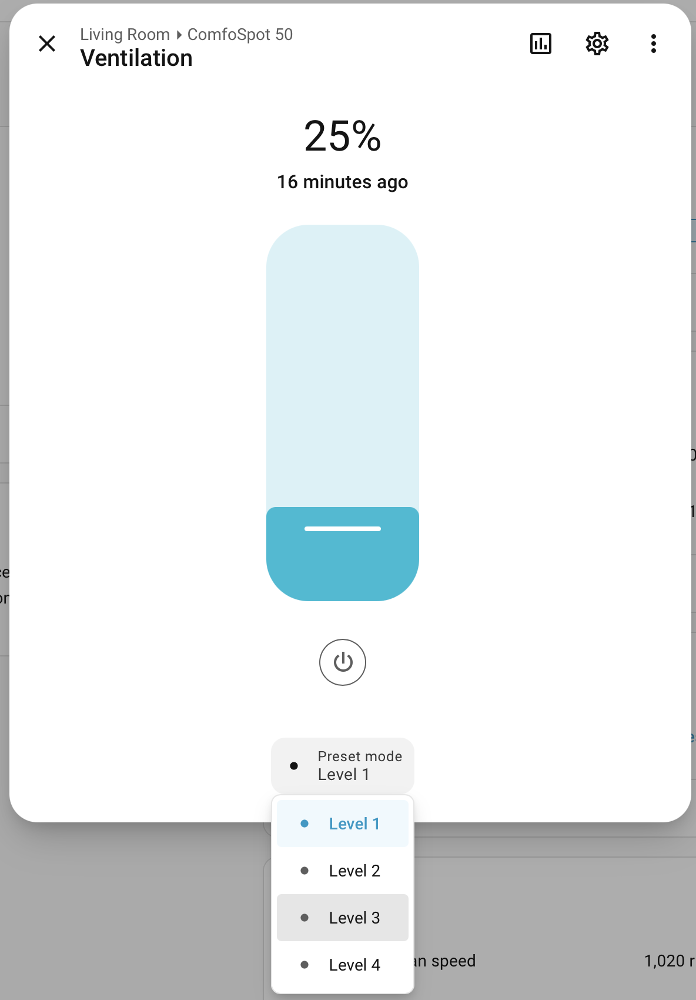
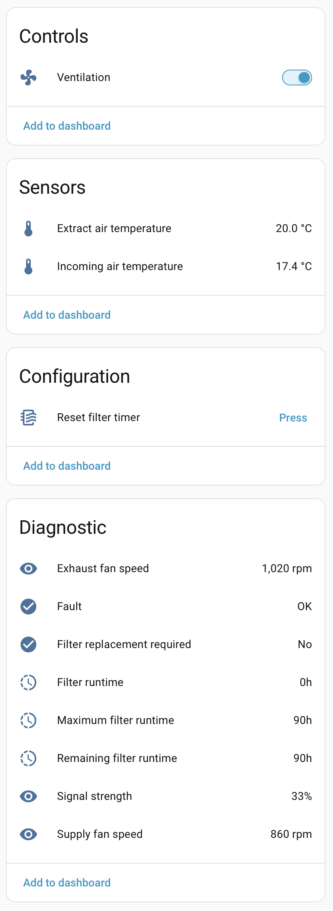

# Zehnder ConnectBox for Home Assistant

Zehnder ConnectBox is an unofficial Home Assistant custom integration for
locally controlling supported ventilation units through a standard Zehnder
ConnectBox gateway.

> [!IMPORTANT]
> **This is a software-only integration.** It communicates directly with the
> existing ConnectBox over the local network. No ESP, replacement control
> board, additional bridge, wiring change, or other hardware modification is
> required.

The integration runs locally and does not contact a Zehnder cloud service or
send telemetry to the project maintainers. It also exposes more technical
information than the official app, including fan speeds, temperatures, filter
counters, radio signal strength, and device diagnostics.



> [!NOTE]
> This is an independent community project. It is not affiliated with,
> endorsed by, sponsored by, or supported by Zehnder Group. Zehnder,
> ConnectBox, ComfoSpot, and ComfoAir are trade marks or product names of their
> respective owners and are used only to describe compatibility.

## Compatibility

This integration is for the **Zehnder ConnectBox CU-RF-ZMA**. It is not for the
separate ComfoConnect LAN C interface used by ComfoAir Q units. Home Assistant
already provides a
[ComfoConnect integration](https://www.home-assistant.io/integrations/comfoconnect/)
for that product family.

| Product | Status |
| --- | --- |
| Zehnder ConnectBox CU-RF-ZMA | Supported gateway |
| Zehnder ComfoSpot 50 | Confirmed on physical hardware |
| Zehnder ComfoAir 70 | Provisional support; physical hardware testing is still needed |
| Other devices connected to a ConnectBox | Detected, but not controlled until their profile is verified |

If you own a ComfoAir 70, testing and sanitized diagnostics are especially
welcome. Please open a
[device feedback issue](https://github.com/andyblenk/ha-zehnder-connectbox/issues/new?template=device_feedback.yml).

## What the integration provides

- Automatic local discovery, with manual address entry as a fallback
- Physical pairing with the existing ConnectBox
- One Home Assistant gateway device for each ConnectBox
- Separate Home Assistant devices for supported connected ventilation units
- Automatic detection of supported units linked later in the official app
- Native fan, switch, select, sensor, binary-sensor, and button entities
- Local polling, automatic reconnect, and privacy-preserving diagnostics
- Multiple ConnectBoxes as separate Home Assistant config entries

The official Zehnder app is still used to commission the system and link
ventilation units to the ConnectBox. It does not need to remain open for this
integration to operate.

## Supported entities

### ConnectBox gateway

| Entity | Home Assistant type | Function |
| --- | --- | --- |
| Central ventilation | Switch | Places the complete connected system in standby or restores the last active mode |
| Operating mode | Select | Automatic, manual, antifreeze, or off |

The ConnectBox firmware version is shown in its Home Assistant device
information when reported by the gateway.

### Supported ventilation unit

| Entity | Home Assistant type | Function |
| --- | --- | --- |
| Ventilation | Fan | Levels 1–4 as 25–100%, named level presets, and off where supported |
| Extract air temperature | Sensor | Temperature of air extracted from the room |
| Incoming air temperature | Sensor | Temperature of incoming outdoor air |
| Exhaust fan speed | Diagnostic sensor | Exhaust fan speed in rpm |
| Supply fan speed | Diagnostic sensor | Supply fan speed in rpm |
| Filter runtime | Diagnostic sensor | Hours elapsed since the last filter reset |
| Remaining filter runtime | Diagnostic sensor | Hours remaining before filter maintenance is due |
| Maximum filter runtime | Diagnostic sensor | Configured filter maintenance interval |
| Filter replacement required | Diagnostic binary sensor | Indicates that filter maintenance is due |
| Fault | Diagnostic binary sensor | Indicates a currently reported device fault |
| Signal strength | Diagnostic sensor | Radio signal strength between the unit and ConnectBox |
| Reset filter timer | Configuration button | Resets the filter counter after filter maintenance; currently verified for ComfoSpot 50 |

The ventilation fan entity provides Home Assistant's standard power and speed
controls. Levels 1–4 can be selected directly as named presets or set as
25–100% fan speed.



Firmware and valid hardware versions are displayed in the ventilation unit's
device information. Optional values are shown only when the connected product
actually reports them.

Firmware updates, installer-only settings, and unverified functions such as a
temporary boost mode are deliberately not exposed.



See the [screenshot gallery](docs/screenshots.md) for pairing and device views.

## Requirements

Before installing this integration:

1. The ventilation unit must have a compatible wireless module installed.
2. A Zehnder ConnectBox CU-RF-ZMA must be connected to the same local network
   as Home Assistant.
3. The official Zehnder Connect app must already be commissioned and working
   locally.
4. The ventilation unit and ConnectBox must already be linked in the app.

No additional controller, adapter, microcontroller, or cloud service is
required.

## Installation with HACS

The repository is not yet part of the default HACS catalogue. Install it as a
custom repository:

1. Open **HACS** in Home Assistant.
2. Open **Integrations**, then the three-dot menu.
3. Select **Custom repositories**.
4. Add `https://github.com/andyblenk/ha-zehnder-connectbox` with category
   **Integration**.
5. Download **Zehnder ConnectBox** and restart Home Assistant.

## Setup

1. Open **Settings -> Devices & services -> Add integration**.
2. Search for **Zehnder ConnectBox**.
3. Wait for the short local discovery scan and select the desired ConnectBox.
4. If discovery cannot cross your network boundary, choose manual setup and
   enter the ConnectBox address.
5. Confirm pairing and briefly press the access-key button on the ConnectBox
   while its indicator is blinking.

Home Assistant creates the gateway device and each recognized ventilation
unit behind it. If another supported unit is linked later in the Zehnder app,
it is added during a subsequent refresh. Assign Home Assistant areas normally;
the integration does not create duplicate room entities.

## Filter timer reset

Only use **Reset filter timer** after the filters have actually been cleaned or
replaced. The integration first acknowledges the filter-replacement state,
waits for the ConnectBox to confirm the write, resets the current runtime to
zero, and reads the value back.

Home Assistant button entities cannot require a confirmation dialog on their
device page. To protect this action on a dashboard, use a confirmation action
and replace the example entity ID with your own:

```yaml
type: button
entity: button.comfospot_50_reset_filter_timer
name: Reset filter timer
icon: mdi:air-filter
tap_action:
  action: perform-action
  perform_action: button.press
  target:
    entity_id: button.comfospot_50_reset_filter_timer
  confirmation:
    title: Reset filter timer?
    text: Confirm only after the filters have been cleaned or replaced.
    confirm_text: Reset
    dismiss_text: Cancel
```

Direct presses from the device page, Developer Tools, scripts, or automations
execute the reset without that dashboard confirmation.

## Troubleshooting and diagnostics

- Home Assistant and the ConnectBox must be able to reach each other on the
  local network. Client isolation and VLAN firewall rules can block discovery
  or control.
- If discovery fails but routing is available, use manual setup with the
  ConnectBox IP address.
- The gateway certificate is trusted during deliberate physical pairing and
  pinned for later connections. A certificate change is treated as a security
  error rather than being accepted silently.
- Download diagnostics from the integration entry before opening an issue.
  Diagnostics omit host addresses, names, serial numbers, UUIDs, certificate
  fingerprints, pairing material, and raw protocol frames.

For defects, use [GitHub Issues](https://github.com/andyblenk/ha-zehnder-connectbox/issues).
For questions, ideas, and broader device feedback, use
[GitHub Discussions](https://github.com/andyblenk/ha-zehnder-connectbox/discussions).
Please review every screenshot and diagnostic attachment for private data.

## Safety and responsibility

Install and operate this integration at your own risk. It is not supported by
the manufacturer. Keep the original controls available and verify correct
ventilation operation after installation and updates. The integration does
not replace required maintenance, safety checks, or filter changes.

## Versioning and releases

Releases follow [Semantic Versioning](https://semver.org/). HACS installs the
version published in a GitHub release. Pre-1.0 releases may still change as
additional hardware feedback is incorporated.

## License and acknowledgements

Copyright 2026 Andreas Blenk and contributors. Licensed under the
[Apache License 2.0](LICENSE).

The integration depends on `tlslite-ng` for a TLS profile scoped to the local
gateway connection. See [third-party notices](THIRD_PARTY_NOTICES.md). No
manufacturer application code, firmware, artwork, or network captures are
included in this repository.

If this integration is useful to you, you can
[buy me a coffee](https://buymeacoffee.com/andyblenk). Contributions and
constructive feedback are welcome.
