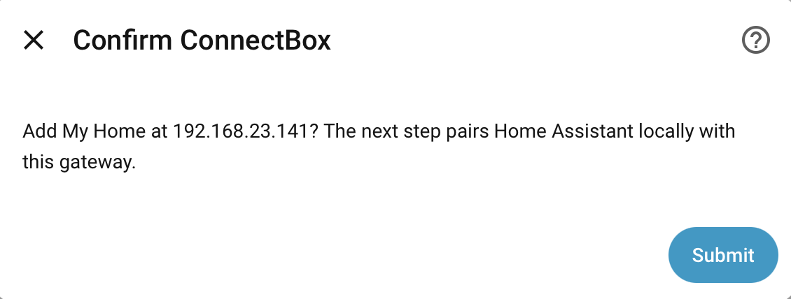
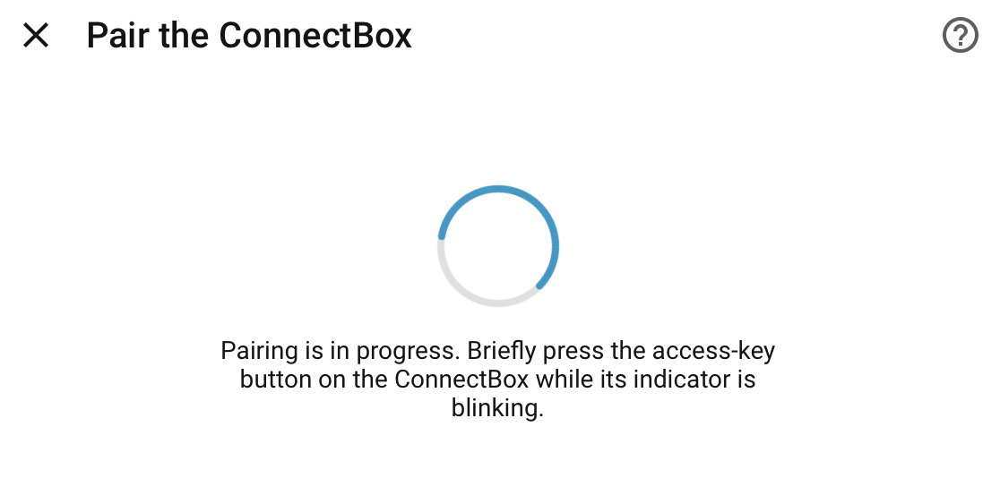
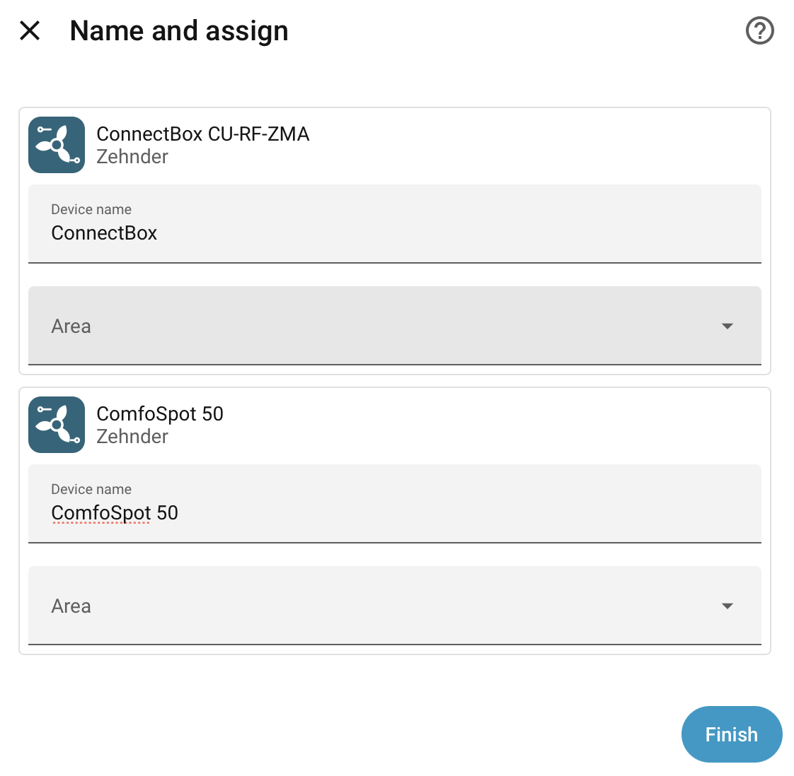

# Screenshots

These screenshots show the current Zehnder ConnectBox integration in Home
Assistant. Labels and layout may differ slightly between Home Assistant
versions and languages.

## Automatic discovery

Home Assistant searches the local network for available ConnectBoxes and
offers each discovered gateway for confirmation. The address can also be
entered manually when discovery cannot cross a network boundary.

## Local pairing

Adding the integration starts a local pairing request. Briefly press the
access-key button on the existing ConnectBox while its indicator is blinking.
No extra hardware or cloud login is required.

## Devices and areas

After pairing, Home Assistant creates the ConnectBox as a gateway and each
supported connected ventilation unit as a separate device. Both can be named
and assigned to Home Assistant areas.

## ConnectBox gateway

The gateway provides the central standby control and the system-wide operating
mode. Connected ventilation units are listed below it.

## ComfoSpot 50 entities

The confirmed ComfoSpot 50 profile exposes ventilation level control,
temperatures, fan speeds, filter information, radio signal strength, faults,
and the filter reset action.

### Ventilation control

The fan entity supports power control, fan speed from 25–100%, and the named
presets Level 1 through Level 4.

### Entity overview

[Back to the main documentation](../README.md)
